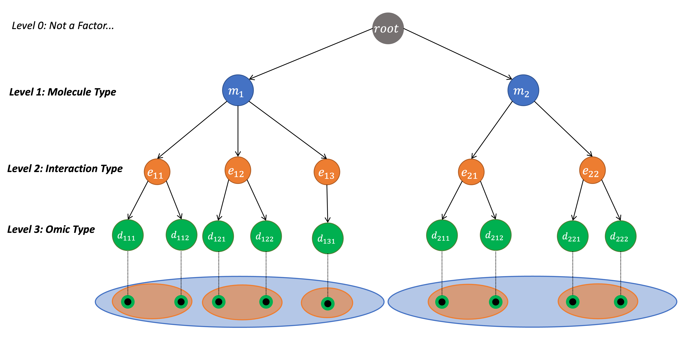
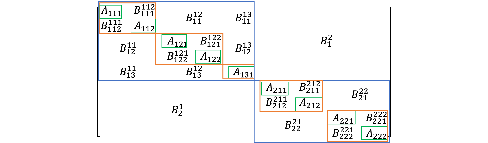

<!-- README.md is generated from README.Rmd. Please edit that file -->
<!--  
devtools::build_rmd("README.Rmd")
-->

# HMNM (Hierarchical Multilayer Network Models)

<!-- badges: start -->
<!-- badges: end -->

The *HMNM* package (Hierarchical Multilayer Network Models) provides
functionality for constructing and analyzing hierarchical multilayer
networks. A multilayer network consists of distinct layers with nodes or
edges that differ from other layers by some characteristic.
Functionalities of *HMNM* include multilayer network construction,
network diffusion (Random Walk with Restart), and module identification
([AMEND](https://www.ncbi.nlm.nih.gov/pmc/articles/PMC10324253/)).

In *HMNM* , each layer is defined by categories coming from one or more
factors that are organized hierarchically. The purpose of the hierarchy
is to govern how information flows between layers during diffusion
processes, namely Random Walk with Restart (RWR); information is shared
more easily between layers located closer in the hierarchy. This
hierarchy can have an arbitrary number of levels that correspond to
factors, where factors can describe node/edge types or node/edge
attribute types. One guiding principle for hierarchy design is to set
the factors for each level such that more similar layers are closer
together in the hierarchy.

Below is an example of a hierarchy for a multilayer network. There are 3
levels corresponding to the factors “Molecule Type”, “Interaction Type”,
and “Omic Type”. Level 0 serves only as a structural anchor to ensure
the hierarchy remains connected. It does not represent any factor and
does not need to be set by the user. The top level is level 1. The leaf
categories at the bottom level (in green, level 3) are associated with
individual layers of the multilayer network, represented by solid black
circles. The nodes and edges of each layer are defined by the
combination of its ancestor categories in the hierarchy. Not shown are
possible inter-layer connections. Below this is the corresponding
adjacency matrix for the multilayer network. Each colored rectangle
corresponds to a category in the hierarchy and encompasses the layers it
is associated with. Intra-layer adjacency matrices are given by **A**’s
and inter-layer/bipartite adjacency matrices are given by **B**’s.

<div class="figure" style="text-align: center">


<p class="caption">
Figure 1: Network Hierarchy
</p>

</div>

<div class="figure" style="text-align: center">


<p class="caption">
Figure 2: Multilayer Adjacency Matrix
</p>

</div>

The two main analysis methods available in *HMNM* are RWR and the
[AMEND](https://www.ncbi.nlm.nih.gov/pmc/articles/PMC10324253/)
algorithm (Active Module identification with Experimental data and
Network Diffusion), both generalized for hierarchical multilayer
networks. Random Walk with Restart (RWR) is a powerful network diffusion
method that returns node scores reflecting proximity in the network to
other high scoring nodes. Node scores can be used for node ranking, link
prediction, or machine learning algorithms. AMEND is an active module
identification method that finds a single, connected module of densely
connected nodes with large experimental values (e.g., from ’omic
experiments). It uses RWR to create node weights, which are used to find
a maximum-weight connected subnetwork, with this subnetwork used as
input into RWR for the next iteration. This continues until an optimal
subnetwork (i.e., module) is found. AMEND can accommodate multilayer
networks, making it a widely applicable tool. These complex networks can
include several node types, edge types, and data types.

## Installation

You can install *HMNM* from [GitHub](https://github.com/samboyd0/HMNM)
with:

``` r
devtools::install_github("samboyd0/HMNM", build_vignettes = TRUE)
```

## Vignette

A vignette is available that illustrates how to use the *HMNM* package.
It can be accessed with the following code.

``` r
vignette("use_HMNM", package = "HMNM")
```

## Author(s)

Sam Boyd (Channing Division of Network Medicine, Brigham & Women’s
Hospital, Harvard Medical School)

<!-- You'll still need to render `README.Rmd` regularly, to keep `README.md` up-to-date. `devtools::build_readme()` is handy for this. You could also use GitHub Actions to re-render `README.Rmd` every time you push. An example workflow can be found here: <https://github.com/r-lib/actions/tree/master/examples>. -->
<!-- In that case, don't forget to commit and push the resulting figure files, so they display on GitHub and CRAN. -->
